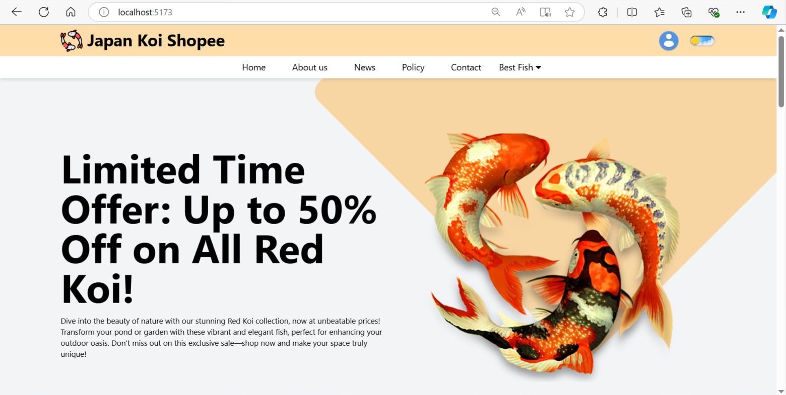

# KoiFarmShop_FE

## ✍️ Description
* The UI Website for using APIs from KoiFarmShop_BE
* The website about Japan Koi Shopee using `ReactJS`, `Axios` at scope **Group Project PRN231**.
* 👉 [Click here](#) to view Backend API on Azure.
* 👉 [Click here](#) to view Web on Vercel.

## 💻 Tech Stack

**Frontend:** ReactJS, Tailwind

## 📷 Screenshots




# 🔥 How to run

* Clone project to your computer.
```
git clone https://github.com/PRN231-KoiFarmShop/KoiFarmShop_FE.git
npm install
npm run dev

```
* The project default start at `http://localhost:5173`